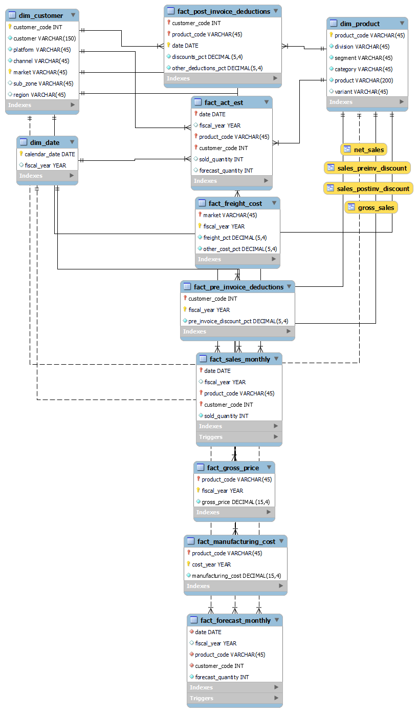

# 💻 AtliQ Hardware: Sales & Supply Chain Analytics (SQL)

---

## 📌 Project Overview
This project provides data-driven insights for **AtliQ Hardware** to optimize sales strategies and supply chain efficiency. Using a **Star Schema** design, I developed complex SQL queries, stored procedures, and views to automate financial reporting and performance tracking.

---

## 🏗️ Data Architecture
The project utilizes a relational database structure designed for high-performance analytics.

### **Entity Relationship Diagram (ERD)**

**The architecture consists of:**
* **Dimension Tables:** `dim_customer`, `dim_product`, and `dim_date` for descriptive attributes.
* **Fact Tables:** `fact_sales_monthly`, `fact_act_est`, `fact_forecast_monthly`, and `fact_freight_cost` for quantitative transactions.
* **Analytics Views:** Pre-calculated metrics for `net_sales`, `gross_sales`, and invoice deductions.

---

## 🚀 Key Features & SQL Logic
* **Finance Analytics:** Automated the calculation of Gross and Net Sales through optimized **MySQL Views**.
* **Supply Chain Insights:** Developed **Stored Procedures** to calculate Forecast Accuracy, helping to minimize inventory carrying costs.
* **Performance Tracking:** Created dynamic procedures to identify **Top N Products** and **Top N Markets** using Window Functions.
* **Fiscal Reporting:** Built **User-Defined Functions** to handle custom Fiscal Year/Quarter logic.

---

## 🛠️ Tools Used
* **Database:** MySQL
* **Modeling:** MySQL Workbench (Star Schema)
* **Advanced SQL:** CTEs, Window Functions, Stored Procedures, and UDFs.

---

## 📬 Connect with Me
If you have any feedback or would like to collaborate, feel free to reach out!

* **LinkedIn**: [Mahima Prasad](https://www.linkedin.com/in/mahima-prasad-analyst/)
* **Portfolio**: [Mahima Prasad - Portfolio](https://codebasics.io/portfolio/Mahima-Prasad)
